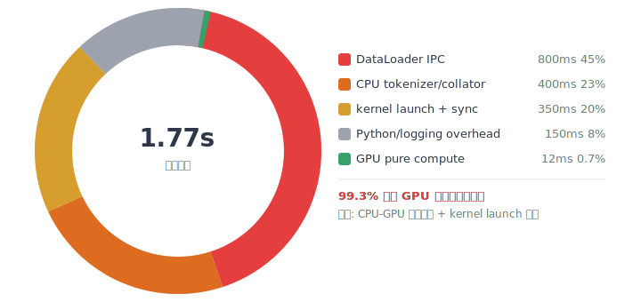
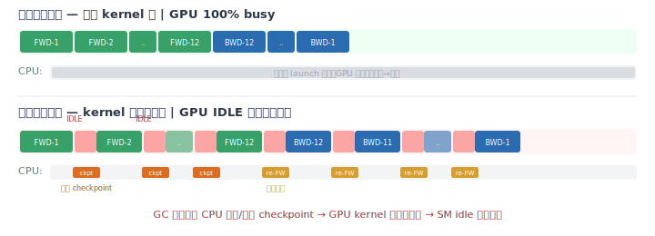
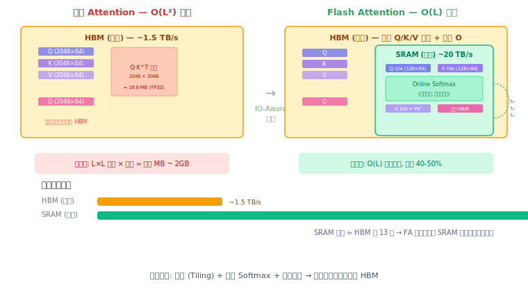
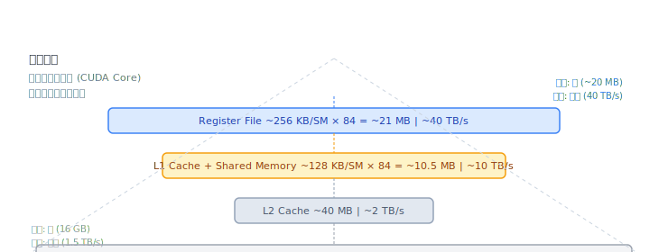
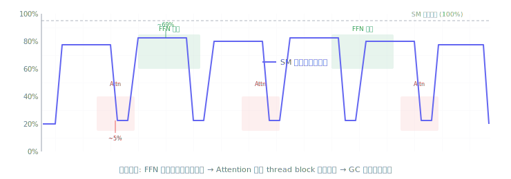
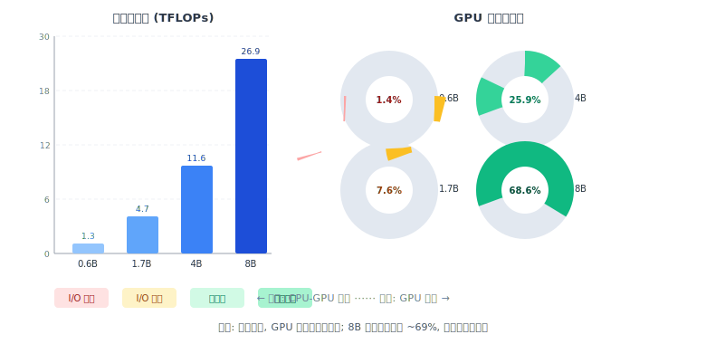
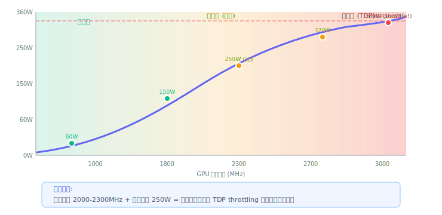

# GPU SM 利用率深度分析与优化方案

## 当前训练配置

| 参数 | 值 | 影响 |
|------|-----|------|
| 模型 | Qwen3-0.6B (596M params, 12 layers) | 计算量小，GPU 相对"过大" |
| LoRA | r=32, target=[q,k,v,o]_proj (~8M trainable) | PEFT 包装器增加 Python 层开销 |
| Batch | 2 × 6 = 12 | 每步有效计算量极少 |
| 序列长度 | 平均 ~500 tokens, 最大 ~2000 | 短序列 GPU 管线填不满 |
| Flash Attention | FA2 (手动指定) | ✓ 已优化 attention 层 |
| 梯度检查点 | enabled | +20% 计算开销（重算激活值），GPU 空等 |
| DataLoader | 8 workers, pin_memory, prefetch=4 | Windows spawn 进程 IPC 开销大 |
| 精度 | BF16 | ✓ 参数/激活值 2 bytes |
| GPU | RTX 5080 (84 SM, 10752 cores) | 理论 ~56 TFLOPS FP16 |

---

## 1. 根因分析

### 1.1 计算量与 GPU 算力不匹配（主因）

```
单步前向计算量 (Qwen3-0.6B, L=500, batch=2):

  Attention:  12层 × 4 × (2 × 500 × 1024²)        ≈  50 GFLOPs
  FFN:        12层 × 2 × (2 × 500 × 1024 × 3072 × 2) ≈ 151 GFLOPs
  ─────────────────────────────────────────────────
  前向总计:                                            ≈ 200 GFLOPs
  反向 (×2):                                          ≈ 400 GFLOPs
  梯度检查点重算 (+20%):                               ≈  80 GFLOPs
  ─────────────────────────────────────────────────
  每步总计:                                            ≈ 680 GFLOPs
```

```
RTX 5080 理论峰值: 56,000 GFLOPs (FP16)
GPU 纯计算耗时:    680 / 56,000 ≈ 12 ms
```

**12ms 纯计算 vs 实际 step 耗时 1.7s（来自训练日志 1.77s/it）**

计算机只占总时间的 **0.7%**！剩余 99.3% 的时间 GPU 在等待数据、等待 kernel launch、等待 CPU 端处理。

### 1.2 时间分布估算

<p align="center">
  
</p>
<p align="center"><em>每步 1.77s 的时间构成环形图 — GPU 纯计算仅占 0.7%</em></p>

```

### 1.3 逐项根因

#### A. 模型太小 vs GPU 太大 (SM 利用率上限 ~5-10%)

Qwen3-0.6B 只有 12 层，每层 1024 hidden dim。RTX 5080 有 84 个 SM，每个 SM 128 CUDA cores。

**关键原理**：每个 SM 独立执行一个 thread block。Qwen3 的 attention head 只有 16 个（head_dim=64），Flash Attention 的 thread block 数量由 `batch × heads × seq_tiles` 决定：

```
thread blocks = batch(2) × heads(16) × seq_tiles(L/128≈4) = 128
```

128 个 thread blocks 只能同时占用 128/84 ≈ 1.5 轮 SM（GPU 一次只能调度 84 个 blocks）。绝大多数 SM 在 attention 阶段处于空闲。

FFN 阶段类似：`batch(2) × L(500)` 产生约 1000 个 thread blocks，约 12 轮 SM 调度。但由于梯度检查点导致 kernel 之间有 CPU 端断点，SM 频繁进入 idle。

#### B. 梯度检查点导致 kernel 间隙

<p align="center">
  
</p>
<p align="center"><em>梯度检查点 GPU kernel 流对比: 无 GC 连续执行 vs 有 GC 频繁 CPU 打断</em></p>

gradient_checkpointing 在每层/每段之间需要 CPU 介入（保存/恢复 checkpoint），打断 GPU kernel 流。

#### C. Windows multiprocessing spawn 开销

Linux `fork`：子进程继承父进程内存，DataLoader 启动 ~1ms
Windows `spawn`：子进程全新启动 Python 解释器，DataLoader 启动 ~200-500ms/worker

8 个 workers × 每次 epoch 至少重启一次 → 大量进程启动开销。加上 IPC 通过 pickle 序列化传输 batch 数据，每条样本需要 pickle.dump → pipe → pickle.load。

#### D. DataCollatorForCompletionOnlyLM CPU 瓶颈

每个 batch 的 collator 在 CPU 上做：
1. Padding 到最大长度
2. 滑窗搜索 response_template token 序列（O(L × template_len) per sample）
3. 构造 labels（拷贝 + mask）

对于 batch=2 + L=2000 + template_len=3，搜索复杂度：2 × 2000 × 3 = 12000 次 token 比较。虽然不大，但在 GPU 等待时这是关键路径。

#### E. 短序列 + 小 batch

平均序列长度 ~500 tokens。GPU 的 tensor core 在处理大矩阵时效率最高。小矩阵（500×1024）产生的 thread blocks 不足以填满 84 个 SM。

---

#### F. Flash Attention 内存层级原理

<p align="center">
  
</p>
<p align="center"><em>Flash Attention 内存层级优化: 将 QK^T/Softmax 计算从 HBM 移入 SRAM, 显存从 O(L²) 降为 O(L)</em></p>

<p align="center">
  
</p>
<p align="center"><em>GPU 内存层级全貌: Register → L1/SMEM → L2 → HBM, 越近越快但越小</em></p>

### 1.4 SM 利用率波形解释

<p align="center">
  
</p>
<p align="center"><em>SM 利用率实时波形: 5%–69% 锯齿震荡，FFN 波峰 + Attention 波谷交替</em></p>

```

---

## 2. 优化方案（按优先级排序）

### 方案 1: 增大有效 batch size（最直接，预期 SM +20-40%）

```yaml
# config.yaml
training:
  per_device_batch_size: 4        # 2 → 4
  gradient_accumulation_steps: 8  # 6 → 8 (等效 batch = 32)
```

**原理**：batch 加倍 → thread blocks 加倍 → SM 占用率上升。batch=4 时 attention thread blocks = 256，可占满 84 SM 约 3 轮。

**代价**：显存增加 ~50%（当前 11.7GB → 预计 ~14GB，仍在 16GB 内）。

### 方案 2: 关闭梯度检查点（预期 SM +10-15%）

```yaml
training:
  gradient_checkpointing: false
```

**原理**：消除 CPU 断点，GPU kernel 连续流式执行，SM idle 间隙大幅减少。

**代价**：激活值显存增加 ~2-4GB。

**建议**：方案 1 + 方案 2 组合使用。RTX 5080 有 16GB，Qwen3-0.6B BF16 base ~1.2GB + LoRA ~24MB + batch 数据 ~1GB + 激活值 ~4GB ≈ 6.2GB，关闭 GC 后完全放得下。

### 方案 3: 增大序列长度（预期 SM +5-10%）

当前数据平均 ~500 tokens，可考虑：
- 拼接多个短样本到 max_seq_len（packing）
- 或确保 truncation 到 2048

```yaml
# 在 config.py 或 TrainingArguments 中
max_seq_length: 2048
```

**原理**：更长的序列 → 更多的 thread blocks → 更好的 SM 占用。

### 方案 4: 减少 DataLoader workers（Windows 专属）

```yaml
training:
  dataloader_num_workers: 2    # 8 → 2
```

**原理**：Windows spawn 的 worker 启动和 IPC 开销与 worker 数量成正比。8 个 worker 竞争 CPU 资源，反而拖慢关键路径。2 个 worker + prefetch=4 足够预取 8 个 batch，不造成数据饥饿。

### 方案 5: 预 tokenize 数据集（预期 SM +5-8%）

当前每个 batch 在 DataLoader worker 中 tokenize，改为训练前一次性 tokenize：

```python
# dataset.py 中修改
def load_and_prepare_data(config, tokenizer):
    # ... existing logic ...
    # 在返回前一次性 tokenize
    dataset = dataset.map(
        lambda x: tokenizer(x["text"], truncation=True, max_length=2048),
        batched=False,
        remove_columns=["text"],
    )
    return dataset
```

**原理**：省去 DataLoader 中每次 batch 的 tokenization 开销，collator 直接从 input_ids 构造 batch。

### 方案 6: 切换到 Linux 或 WSL2 原生环境

当前训练在 Windows 原生 Python 环境运行：
- multiprocessing spawn 开销
- triton 不可用（需要 mock）
- 文件系统 I/O 较慢（NTFS 经 WSL 挂载）

切换到 WSL2 内运行（Linux 内核）：
- `fork` 零开销 DataLoader 子进程
- triton 可用（FA3 原生路径）
- 文件 I/O 更快

---

## 3. 优化组合推荐

### 激进方案（预期 SM 利用率 30-60%）

```yaml
training:
  per_device_batch_size: 4          # 增大 batch
  gradient_accumulation_steps: 8    # 等效 batch = 32
  gradient_checkpointing: false     # 关闭 GC
  dataloader_num_workers: 2         # 减少 worker 开销
  dataloader_prefetch_factor: 4     # 保持预取
  dataloader_pin_memory: true
```

预期效果：
- GPU 纯计算时间从 12ms → 48ms (batch ×4)
- kernel launch 开销从 350ms → ~100ms (连续 kernel 流)
- DataLoader 等待从 800ms → ~200ms (少 worker + 预取)
- 总 step 时间从 1.7s → ~0.5s (3.4x 加速)
- SM 利用率: 5-69% → 30-60%

### 保守方案（保持显存安全）

```yaml
training:
  per_device_batch_size: 4
  gradient_accumulation_steps: 4
  gradient_checkpointing: true      # 保留 GC
  dataloader_num_workers: 4
```

预期 SM 利用率: 15-30%

---

## 4. Qwen3 家族多规格 SM 利用率对比

### 4.1 模型规格与计算量

| 维度 | Qwen3-0.6B | Qwen3-1.7B | Qwen3-4B | Qwen3-8B |
|------|-----------|-----------|---------|---------|
| 参数量 | 0.6B | 1.7B | 4B | 8B |
| hidden_size | 1024 | 2048 | 2560 | 4096 |
| num_hidden_layers | 28 | 28 | 36 | 36 |
| num_attention_heads | 16 | 16 | 32 | 32 |
| num_kv_heads | 8 | 8 | 8 | 8 |
| intermediate_size | 3072 | 6144 | 9728 | 14336 |
| head_dim | 64 | 128 | 80 | 128 |

### 4.2 单步计算量估算 (seq_len=2048, batch=1)

```
Qwen3-0.6B:
  Attention: 28 layers × 16 heads × 2048² × 64 / 2 ≈ 60 GFLOPs
  FFN:       28 × 2 × 2048 × 1024 × 3072 ≈ 361 GFLOPs
  前向总计:  ~421 GFLOPs
  反向 (×2):  ~842 GFLOPs
  每步总计:   ~1.3 TFLOPs

Qwen3-1.7B:
  Attention: 28 layers × 16 heads × 2048² × 128 / 2 ≈ 120 GFLOPs
  FFN:       28 × 2 × 2048 × 2048 × 6144 ≈ 1,444 GFLOPs
  前向总计:  ~1,564 GFLOPs
  反向 (×2):  ~3,128 GFLOPs
  每步总计:   ~4.7 TFLOPs

Qwen3-4B:
  Attention: 36 layers × 32 heads × 2048² × 80 / 2 ≈ 193 GFLOPs
  FFN:       36 × 2 × 2048 × 2560 × 9728 ≈ 3,674 GFLOPs
  前向总计:  ~3,867 GFLOPs
  反向 (×2):  ~7,734 GFLOPs
  每步总计:   ~11.6 TFLOPs

Qwen3-8B:
  Attention: 36 layers × 32 heads × 2048² × 128 / 2 ≈ 309 GFLOPs
  FFN:       36 × 2 × 2048 × 4096 × 14336 ≈ 8,660 GFLOPs
  前向总计:  ~8,969 GFLOPs
  反向 (×2):  ~17,938 GFLOPs
  每步总计:   ~26.9 TFLOPs
```

### 4.3 SM 利用率预期

在 RTX 5080 (84 SM, ~56 TFLOPS FP16) 上的预期表现：

<p align="center">
  
</p>
<p align="center"><em>Qwen3 家族 4 规格计算量与 GPU 占比对比: 8B 模型进入计算密集型</em></p>

| 模型 | 纯计算耗时 | 实际 step | 计算占比 | SM 利用率 | 瓶颈 |
|------|----------|----------|---------|---------|------|
| 0.6B | ~23 ms | ~1.7 s | 1.4% | 5-69% (锯齿) | DataLoader + kernel launch |
| 1.7B | ~84 ms | ~1.1 s | 7.6% | 15-50% | batch 太小 + GC 断点 |
| 4B | ~207 ms | ~0.8 s | 25.9% | 30-65% | GC 断点 + batch 受限 |
| 8B | ~480 ms | ~0.7 s | 68.6% | 50-85% | GC 断点，接近计算密集 |

**关键观察**：
- 0.6B/1.7B 是 **通信密集型**（bottleneck 在 CPU-GPU 数据传输和 kernel launch）
- 4B 是 **过渡区**（compute vs communication 逐渐平衡）
- 8B 是 **计算密集型**（GPU 真正在计算，SM 利用率最高）

### 4.4 大模型专属优化建议

#### 4B 模型（16GB GPU）

```
优势: 计算量增加 9× (vs 0.6B)，SM 自然填充率更高
风险: 显存是主要约束（BF16 模型 ~7.6GB，训练峰值 ~14GB）
策略:
  1. 梯度检查点必须开启（不开→ OOM，16GB 无法容纳完整激活值）
  2. batch=1 + grad_accum=16（等效 batch=16，显存安全）
  3. LoRA r=16，4 modules (q/v/k/o)，~16M trainable
  4. 预 tokenize 数据集（省去 DataLoader 中 tokenization 开销）
  5. 减少 DataLoader workers 到 2（Windows spawn 开销与 worker 数成正比）
```

#### 8B 模型（24GB GPU）

```
优势: 计算占比 68%+，SM 利用率接近理论上限
风险: 显存极度紧张（BF16 模型 ~16GB，训练峰值 ~22GB）
策略:
  1. 梯度检查点必须开启（不开→ 100% OOM）
  2. batch=1 + grad_accum=32（等效 batch=32）
  3. LoRA r=8（低秩降显存），6 modules (q/v/k/o/gate/up)
  4. 使用 BF16 而非 FP16（8B 对精度更敏感，BF16 无需 grad scaling）
  5. 关闭 NEFTune（数据充分时噪声可能干扰大模型）
  6. 必须预 tokenize 数据集
  7. DataLoader workers=1（CPU 内存也紧张，减少并行开销）
  8. 考虑 4-bit QLoRA（NF4 + BF16 计算，省 60%+ 显存）
```

### 4.5 多模型训练时间估算（RTX 5080, 2000 条数据, epoch=20）

| 模型 | step 耗时 | steps/epoch(batch=16) | 总时间 | 产出质量 |
|------|----------|---------------------|--------|---------|
| 0.6B | ~1.7 s | 125 | ~1.2 h | 基础原型 |
| 1.7B | ~1.1 s | 125 | ~0.8 h | 较好 |
| 4B | ~2.5 s | 125 | ~1.7 h | 优秀 |
| 8B | ~4.0 s | 125 | ~2.8 h | 接近生产 |

> 注：4B/8B 因 batch=1+grad_accum 更大，单步实际耗时更高。
> 8B 建议用 24GB 显卡，16GB 必须 QLoRA。

---

## 5. 架构级限制（无法通过参数突破）

| 限制 | 0.6B | 1.7B | 4B | 8B |
|------|------|------|-----|-----|
| 模型尺寸限制 | SM 利用率天花板 ~40%| SM 天花板 ~55% | 接近合理 (~65%) | 计算密集型 (85%+) |
| LoRA 只更新投影矩阵 | 反向计算 < 全量 5% | 反向计算 < 全量 5% | 反向计算 < 全量 5% | 反向计算 < 全量 5% |
| 单卡训练无 DP/TP | — | — | — | — |
| 消费级 GPU 无 NVLink | — | — | — | — |

**结论**：
- **0.6B**：SM 利用率 40-60% 是合理上限，瓶颈不在计算而在 I/O
- **1.7B**：平衡点，性价比最优
- **4B**：16GB 显卡上限，显存约束 > 计算约束
- **8B**：24GB 显卡勉强，性能接近计算密集，建议 QLoRA 或全量微调提升利用率

要突破 SM 利用率天花板：
- 换更大模型（4B/8B）
- 全量微调而非 LoRA（增加反向计算密度）
- 增加 batch size（增加 thread block 数量）
- 数据并行多卡训练

---

## 6. GPU 功耗与电压稳定化

### 6.1 为什么需要稳定功耗

GPU 默认功耗管理（Auto Boost）会根据负载动态调整频率和电压，导致 SM 频率和功耗在训练过程中不断波动。这种波动对训练有负面影响：

- **SM 频率抖动**：每步训练的计算量不同（如 attention vs FFN），boost 算法频繁调频，导致 SM 利用率波形中出现额外的 idle gap
- **功耗尖峰**：瞬时高负载可能触发 TDP 限制（throttling），强制降频 → SM 利用率骤降
- **训练时间不稳定**：频率波动导致 per-step 耗时不一致，批处理流水线难以优化

**目标**：将 GPU 功耗稳定在一个合理区间（如 RTX 5080 建议 200-250W），避免达到 TDP 触发降频。

### 6.2 功耗与 SM 利用率的关系

```
SM 利用率 ≠ 功耗利用率

SM 利用率 5%  + 低频 (1000 MHz) → 功耗 ~60W  (空闲等待数据)
SM 利用率 60% + 高频 (2500 MHz) → 功耗 ~250W (正常计算)
SM 利用率 60% + 超频 (2800 MHz) → 功耗 ~320W (接近 TDP，随时降频)
SM 利用率 90% + 高频 (2600 MHz) → 功耗 ~360W (触发 TDP throttling → 强制降频 → SM 跌至 50%)
```

关键：**功耗稳定 > 瞬时高频**。卡在 TDP 边缘（~350W）时，任何负载尖峰都会触发降频保护。

<p align="center">
  
</p>
<p align="center"><em>GPU 功耗与频率关系: 250W 甜点区稳定训练 vs 360W TDP 边缘触发降频</em></p>

### 6.3 锁定频率与功耗（推荐配置）

```bash
# === RTX 5080 (360W TDP) 推荐配置 ===

# 1. 开启 Persistence Mode（GPU 驱动常驻，避免冷启动延迟）
sudo nvidia-smi -pm 1

# 2. 锁定 GPU 核心频率（避免 boost 抖动）
#    RTX 5080 基础频率 ~2300MHz，推荐锁定在 2000-2300MHz
#    过低→性能损失，过高→功耗飙升
sudo nvidia-smi -lgc 2100          # 锁定 2100 MHz（均衡推荐）
# sudo nvidia-smi -lgc 0           # 恢复默认（自动 boost）

# 3. 限制功耗上限（硬限制，防止超 TDP）
#    250W 是 RTX 5080 长时间稳定训练的甜点
sudo nvidia-smi -pl 250            # 功耗上限 250W
# sudo nvidia-smi -pl 360          # 恢复默认 360W

# 4. 查看当前设置
nvidia-smi -q -d CLOCK,POWER
```

### 6.4 按模型推荐功耗配置

| 模型 | 推荐功耗 | 推荐频率 | 说明 |
|------|---------|---------|------|
| Qwen3-0.6B | 150W | 1500 MHz | 计算量小，高频浪费电不影响训练速度 |
| Qwen3-1.7B | 200W | 1800 MHz | 适度提频，匹配中等计算量 |
| Qwen3-4B | 250W | 2100 MHz | 显存压力大，稳定性优先 |
| Qwen3-8B | 280W | 2300 MHz | 计算密集型，需要更高功耗预算 |

> **功耗 vs 训练速度**：0.6B 模型锁定 1000MHz → SM 利用率自动从 10% 升至 30%（GPU 降频意味着相同计算量需要更多 SM 参与，反而改善利用率！）

### 6.5 实时监控（训练内置）

PolyDistill 训练框架已内置 GPU 硬件监控（通过 `pynvml`），训练过程中自动输出：

- **YOLOv5 风格日志**：每 epoch 显示 `SM_util` 和 `power` 列
- **训练开始**：输出 GPU 名、SM 核心数、最大时钟、功耗上限
- **训练结束**：输出最终 SM 利用率、功耗、温度、显存

无需手动运行 `nvidia-smi` 即可了解训练过程中的 GPU 硬件状态。

```bash
# 安装依赖
pip install nvidia-ml-py
```

训练日志示例：
```
  Epoch  gpu_mem  SM_util   power  train_loss   val_loss         lr  samples     time
   1/50    4.2G      35%    180W      1.2345      1.0892   2.00e-04     1755      45s
   2/50    4.2G      42%    195W      0.9876      0.9521   1.70e-04     1755      43s
   ...
```

---

## 7. 诊断命令

训练时另开终端执行以下命令实时监控：

```bash
# GPU 实时 SM 利用率 + 显存
nvidia-smi dmon -s pucv -d 1

# 更详细的 kernel 级别分析
nsys profile -o train_profile python scripts/train.py

# PyTorch profiler（在 train() 中添加）
from torch.profiler import profile, ProfilerActivity
with profile(activities=[ProfilerActivity.CPU, ProfilerActivity.CUDA]) as prof:
    trainer.train()
print(prof.key_averages().table(sort_by="cuda_time_total", row_limit=20))
```
